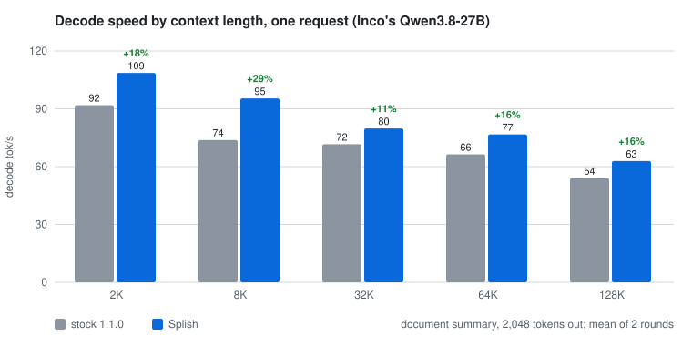
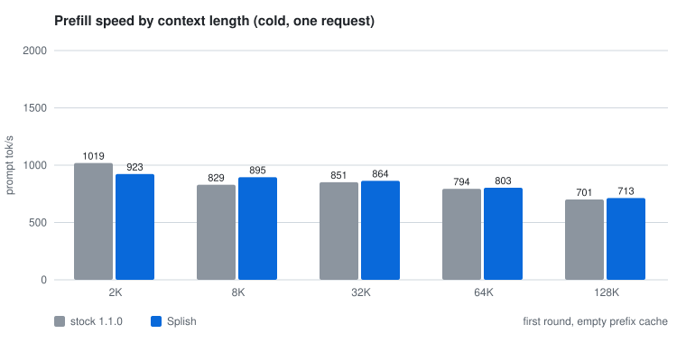
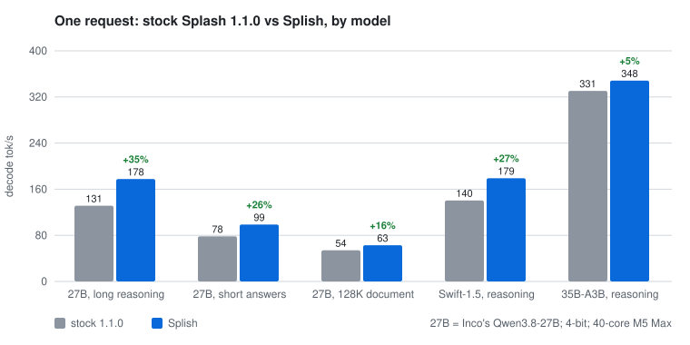
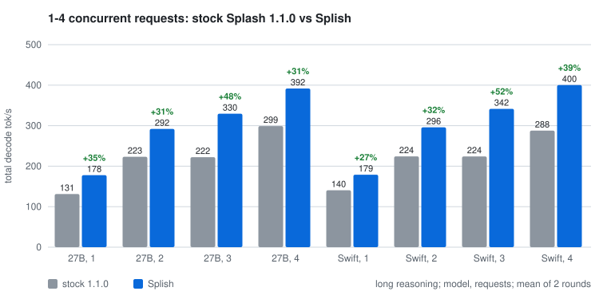
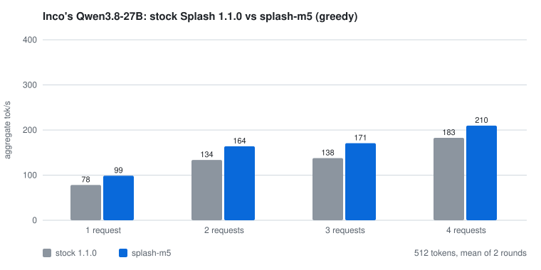
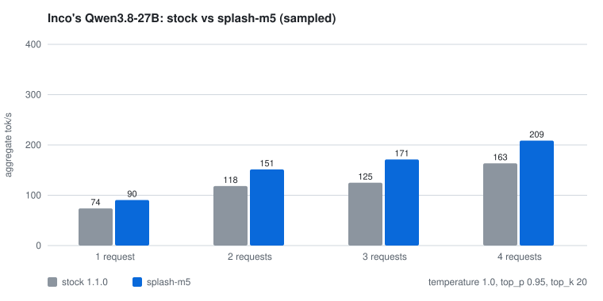
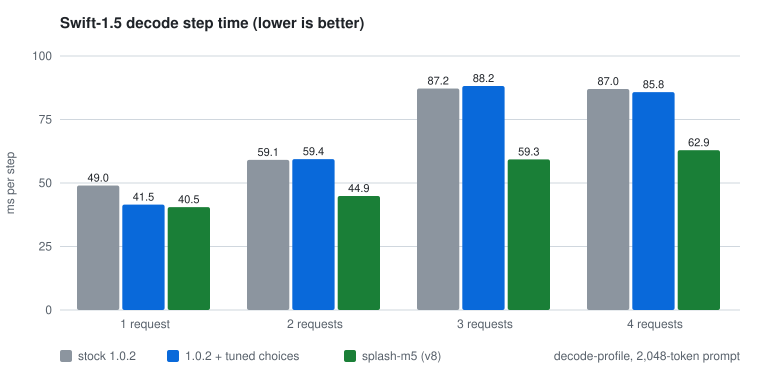
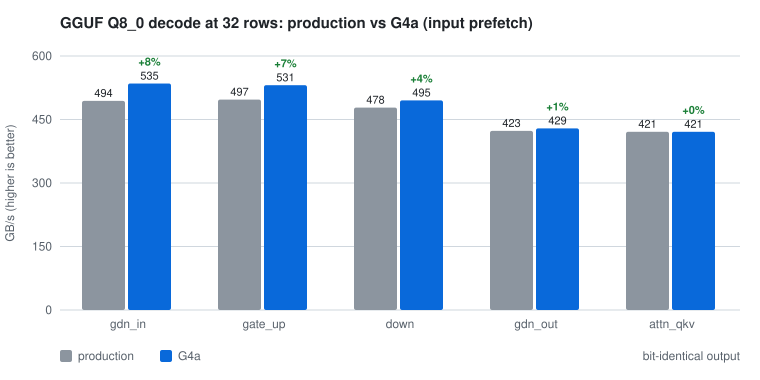
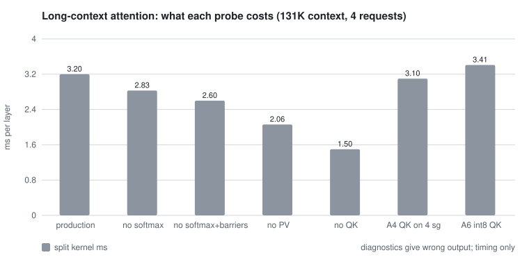

# Splish

**Up to 1.5× faster than Splash as shipped, and about 1.25× on a single request**, with
unchanged quality: Qwen3.8-27B-family 4-bit models on a 40-core M5 Max.

Splish is an **unofficial** fork of [Inco's Splash](https://github.com/incoai/splash), not
affiliated with Inco. It retunes and extends Splash's Metal kernels for Apple **M5**-family
GPUs, and was developed and measured on a 40-core **M5 Max** (128 GB).

**Against Splash 1.1.0 as shipped**, on the same Mac with the same models. Each cell is decode
tok/s, stock → Splish (gain); at 2–4 requests it is the total across requests. Models are 4-bit
affine (MLX-style, group 64, the Splash package format) unless marked GGUF, with Splash's default
int8 KV cache and each model's DFlash2 draft. Method in
[Versus stock Splash](#versus-stock-splash).

| Workload | 1 request | 2 requests | 3 requests | 4 requests |
|---|---:|---:|---:|---:|
| Inco's Qwen3.8-27B, long reasoning | 131 → **178** (+35%) | 223 → **292** (+31%) | 222 → **330** (+48%) | 299 → **392** (+31%) |
| Inco's Qwen3.8-27B, short answers, greedy | 78 → **99** (+26%) | 134 → **164** (+23%) | 138 → **171** (+24%) | 183 → **210** (+15%) |
| Inco's Qwen3.8-27B, short answers, sampled | 74 → **91** (+23%) | 118 → **151** (+28%) | 125 → **171** (+37%) | 163 → **209** (+28%) |
| Inco's Qwen3.8-27B, TensorFold's client: code | 142 → **176** (+24%) | | | |
| Inco's Qwen3.8-27B, TensorFold's client: chat | 75 → **92** (+22%) | | | |
| Inco's Qwen3.8-27B, a 2K–128K-token document ([by context](#by-context-length)) | **+11% to +29%** | 96 → **118** (+24%, 64K) | | |
| Swift-1.5 (a Qwen3.8-27B fine-tune), long reasoning | 141 → **179** (+27%) | 224 → **296** (+32%) | 224 → **342** (+52%) | 288 → **400** (+39%) |
| Qwen3.6-35B-A3B, long reasoning | 331 → **348** (+5%) | 486 → **573** (+18%) | 553 → **672** (+22%) | 642 → **754** (+18%) |

On top of that, the copy rule speeds up whole-file code edits (Swift-1.5, Splish without → with
it): 144 → **180** tok/s (+24%) and 136 → **194** tok/s (+42%).

Quality is unchanged: every model above scores 95/95 on our 95-task set with Splish, as stock did wherever we measured it.

### By context length

One request summarising a document of the given length (a distinct WikiText passage),
2,048 tokens out. Prompts are prefilled into the cache before decode timing starts. Decode
is the mean of 2 rounds; prefill is the cold first round. Inco's Qwen3.8-27B, tok/s, stock →
Splish:

| Context | 2K | 8K | 32K | 64K | 128K |
|---|---:|---:|---:|---:|---:|
| **Decode** | 92 → **109** (+18%) | 74 → **95** (+29%) | 72 → **80** (+11%) | 66 → **77** (+16%) | 54 → **63** (+16%) |
| Prefill | 1,019 → 923 | 829 → 895 | 851 → 864 | 794 → 803 | 701 → 713 |

Decode is faster at every length. Prefill is unchanged: Splish does not touch the prefill
kernels, and these single cold measurements differ by −9% to +8%. Splash's own harness also
finds time to first token even at 2K and 32K.




What the fork adds on top of Splash 1.1.0:

- **New verify kernels for the M5's tensor units.** Split-K kernels that compute each
  projection's row sums once (`SplitSums32`), plus lighter barriers. They carry the gain at
  2–4 requests.
- **Kernel choices measured for the chip** (`tuning/`), loaded from a file
  (`SPLASH_KERNEL_CHOICES`). They carry most of the single-request gain. Shipped Splash cannot
  take them: its choices are compiled in, and its tuner is a developer build target that is
  not in the Homebrew package.
- **A copy rule for coding agents** (from [TensorFold](https://github.com/ashhart/TensorFold)).
  When the last 16+ tokens repeat earlier context, the next draft is the verbatim
  continuation. Output is exact: greedy text is byte-identical, and sampled acceptance uses a
  one-hot draft distribution.
- **Faster GGUF decode** (the G4a staged kernel), bit-identical output: +3–14% per kernel,
  ~2% per step.
- **Tools that keep the numbers honest.** They include a kernel bench checked against fp64, a
  whole-step benchmark with confidence intervals, bit-for-bit build comparison, and a
  steady-state serving benchmark with power readings.

**Where it is not faster.** Long-context attention itself is unchanged; the lead at 64K
comes from everything around it. Qwen3.6-35B at one request gains only 5%, and GGUF models
about 2%. Energy per token is lower at 3–4 requests, but mixed at 1–2.
[Where stock is ahead or even](#where-stock-is-ahead-or-even) lists every case.

Everything else is Inco's: the engine, the package format, the models and draft models, and
the server. The fork tracks upstream releases deliberately (currently Splash 1.1.0; the
`upstream` remote).

- [Quick start](#quick-start)
- [Recommended settings](#recommended-settings)
- [Versus stock Splash](#versus-stock-splash)
- [What worked](#what-worked)
- [What did not](#what-did-not)
- [Ideas left to try](#ideas-left-to-try)
- [Benchmarks and tuning](#benchmarks-and-tuning)
- [Report your results](#report-your-results)
- [Upcoming](#upcoming)
- [Credits](#credits)
- [License](#license)
- [Support](#support)

## Quick start

You need an Apple silicon Mac with macOS 26.4+, Xcode 26 or newer, and Python 3.12–3.14.

```sh
git clone https://github.com/publicExcess/splish.git && cd splish
make -j4
./splish serve --model mlx-community/Qwen3.8-27B-4bit
```

The first serve downloads the model and its DFlash2 draft and prepares the weights, as in
Splash. `./splish` picks the tuned kernel choices for the model and turns on the copy rule; it
prints what it chose. Then connect an agent (`./splish opencode`, `claude`, `codex`, `hermes`,
`pi`) or any OpenAI- or Anthropic-compatible client, as with Splash
([upstream README](docs/UPSTREAM_README.md)).

The tuned choices are for a **40-core M5 Max**. On any other Mac, `./splish` keeps Splash's own
defaults and still turns on the copy rule. Other M5 chips will need their own choices; an
auto-tuner is [upcoming](#upcoming).

**Advanced.** `./splish` only sets these when you have not:

| Variable | Effect |
|---|---|
| `SPLASH_KERNEL_CHOICES=FILE` | Kernel choices to load ([tuning/](tuning/)); unset means Splash's defaults |
| `SPLISH_CHOICES=any` | Apply the tuned choices on a chip other than a 40-core M5 Max |
| `SPLASH_M5_COPY_MIN_MATCH=N` | Copy rule: draft verbatim continuations of N+ repeated tokens (default 16; 0 turns it off) |
| `SPLASH_M5_ACCEPT_LOG`, `SPLASH_M5_TOKEN_LOG` | Diagnostics: acceptance histogram and per-step tokens |

## Recommended settings

| Model | Choices file | Notes |
|---|---|---|
| Qwen3.8-27B family, Splash package (Inco's, Swift-1.5, other fine-tunes) | `tuning/m5max-40c-swift15-v8.choices` | Tuned on a 40-core M5 Max. Other M5 chips: run the tuner (`dev/tuning`). |
| Qwen3.8-27B GGUF Q8_0 | `tuning/m5max-40c-swift15-q80.choices` | ~2% |
| Qwen3.6-35B-A3B | `tuning/m5max-40c-qwen36-35b.choices` | +5/+18/+22/+18% at 1–4 requests |
| Qwen3.8-27B GGUF Q4_K_M, Q6_K | `tuning/m5max-40c-swift15-kquant.choices` | ~2% (the G4a kernel does the work) |

**Copy rule:** on by default through `./splish` (`SPLASH_M5_COPY_MIN_MATCH=16`). It pays off on
agents that rewrite files, never triggers on prose, and costs at most ~3% when it misfires.

Draft length: keep Splash's 7 drafted tokens. On the long-reasoning load 50–62% of verify
steps accept all 7 (45–48% on Qwen3.6-35B). A draft cut to 5 keeps only ~81% of the tokens
per step, more than a shorter verify could save.

Heat: sustained 3–4-request load peaked at 92–94 °C GPU on both engines, with the default fan
behaviour. For long agent sessions, set a fan curve that reaches full speed by 80–85 °C.

## Versus stock Splash

**Method.**
- **Builds.** Stock is vanilla Splash 1.1.0. The fork is this repository with the v8
  choices. Both ran on the same M5 Max with the same packages, side by side on separate
  ports.
- **Serving load.** C concurrent requests (C = 1–4), each generating up to 4,096 tokens
  from a long-reasoning prompt with the recommended sampling (temperature 1.0, top_p 0.95,
  top_k 20).
- **Metric.** Aggregate decode tok/s, counted only while all C requests decode
  (`dev/m5/serve_bench.py`). Package power and GPU temperature come from `macmon` over the
  same window.
- **Repeats.** Each value is the mean of two rounds, with stock and fork alternating. Runs
  vary by up to ~7% (single cells up to 8%), so **differences under about 5% are ties**.
- **Splash's own harness.** `dev/benchmarks/http_regression.py` (ABBA order, `abba.py`'s
  pass rule) measured decode ms per token and time to first token at 2K and 32K context.
- **Quality.** A 95-task set (maths, code, reasoning, exact-match scoring) on both builds.

**Which build.** The long-reasoning, quality and harness numbers (2026-09-26 overnight) use
the current build, G4a and A4 included. The 512-token rows and Swift's step times predate
G4a and A4. Both changes are bit-identical and affect GGUF models and long context only.

### Where Splish leads

Inco's Qwen3.8-27B package (`incoai/Qwen3.8-27B-Splash`), aggregate tok/s, fork and change
against stock:

| Load | C=1 | C=2 | C=3 | C=4 |
|---|---:|---:|---:|---:|
| Greedy, 512 tokens | 98.8 **+26%** | 163.9 **+23%** | 170.8 **+24%** | 209.7 **+15%** |
| Sampled, 512 tokens | 90.5 **+23%** | 151.3 **+28%** | 171.2 **+37%** | 208.6 **+28%** |
| **64K-token document, summarise, steady state** | 73.4 **+12%** | 118.2 **+24%** | | |
| **Long reasoning, steady state, sampled** | 177.7 **+35%** | 292.0 **+31%** | 329.5 **+48%** | 391.8 **+31%** |
| Energy per token, J (stock → fork) | 0.65 → 0.36 | 0.24 → 0.30 | 0.25 → 0.22 | 0.21 → 0.19 |







Stock for reference: greedy 78.2 / 133.7 / 137.8 / 182.6 tok/s, sampled 73.8 / 118.2 /
124.9 / 163.4, and long reasoning 131.3 / 223.2 / 222.2 / 299.0. Long-reasoning maths drafts
very well (about 6.2 tokens per verify step), which is why its tok/s are higher than the
short answers'.

Swift-1.5 on the same long-reasoning load: 140.5 / 224.2 / 224.1 / 287.7 → **179.0 / 295.8 /
341.5 / 400.2** tok/s (+27% / +32% / +52% / +39%). Energy at 4 requests is 0.32 → 0.18 J per
token.

**TensorFold's client** (`tools/bench_openai.py` from
[ashhart/TensorFold](https://github.com/ashhart/TensorFold), via `dev/m5/tensorfold_bench.py`;
64-token replies, 5 seeds, 2 rounds). Code and chat, sampled and greedy, tok/s:

| | Code, sampled | Chat, sampled | Code, greedy | Chat, greedy |
|---|---:|---:|---:|---:|
| Stock Splash 1.1.0 | 156.6 | 77.8 | 142.1 | 75.1 |
| **Splish** | **202.6** | **88.6** | **176.1** | **91.9** |
| TensorFold 0.3.4, as published for an M5 Max | 168.4 | 69.3 | 154.7 | 73.5 |

The TensorFold row is its own published measurement: a different checkpoint and drafter, a
raw-completion code prompt, and a different session. Treat it as a reference point, not a race.

**Splash's own harness** (`http_regression.py`, ABBA, Inco's pass rule) on Inco's 27B: decode
**5.93 → 4.60 ms per token (−22%), pass**. Time to first token is identical at 32K
(39.5 s vs 39.4 s). At 2K it is +0.7%, but that run's spread was 6.9%, above the rule's 5%
limit, so the rule calls it inconclusive rather than a regression.

Swift-1.5 (a Qwen3.8-27B fine-tune, same shapes), decode step time from Splash's
`decode_profile` with a 2,048-token prompt:



| Requests | Stock 1.0.2 | 1.0.2 + tuned choices | Splish (v8) |
|---|---:|---:|---:|
| 1 | 49.0 ms | 41.5 ms | **40.5 ms** |
| 2 | 59.1 ms | 59.4 ms | **44.9 ms** |
| 3 | 87.2 ms | 88.2 ms | **59.3 ms** |
| 4 | 87.0 ms | 85.8 ms | **62.9 ms** |

At one request the fork adds ~2.5% over tuned choices alone. The gain from the fork's own
kernels is at 2–4 requests (1.3–1.5×).

**Quality.** Swift-1.5 scores 95/95 on both engines, and 380/380 with four copies running
concurrently. On Inco's 27B: stock 95/95, fork 95/95. The fork's greedy text
differs from stock at near-ties because the split-K kernels add in a different order. Both
engines are deterministic run to run.

### Where stock is ahead or even

| Case | Result |
|---|---|
| Speculative acceptance, Inco's 27B | Fork 0.380 vs stock 0.398 (greedy, 16 prompts). Slightly lower; the speed gain covers it. |
| Long-context decode (40K+) | Tie. Attention sets the limit, and the one change kept (A4) is ~3% of attention and not visible per step. |
| GGUF Q8_0 decode, 2 requests | Tie (−0.1%). 1, 3 and 4 requests: ~2% faster. |
| Qwen3.6-35B-A3B (tuning) | Not tuned. The fork's attention change is disabled for its shape, where it was 3% slower. |
| Time to first token, 2K / 32K | Tie (+0.7% / −0.2%). The 2K run was too noisy for Inco's rule to pass it. |
| Qwen3.6-35B-A3B, long reasoning, 1–4 requests | Tie: −2% / −1% / −4% / +2%, inside its 5–7% run spread. |

## What worked

1. **Split-K verify kernels with row sums computed once (`SplitSums32`)** on the MPP tensor
   units. The residual, plain and gate/up projections gained at 16–32 rows, which cut the
   step 23–32% at 2–4 requests.
2. **Lighter barriers (H1).** A simdgroup barrier replaces a threadgroup one where a tile
   has one simdgroup.
3. **Measured choices per shape** (`v8`), loaded from a file.
4. **GGUF input prefetch (G4a).** The staged GGUF tile now prefetches its input rows a step
   ahead into space freed from its weight stage. It uses the same threadgroup memory,
   produces bit-identical output and is 2–8% faster at 32 rows.

   
5. **Attention QK on 4 simdgroups for 6-head groups (A4).** Bit-identical; attention 2–3%
   faster.
6. **Tuning a second model with the same kernels.** Splash's `tune-kernels` on Qwen3.6-35B-A3B
   picked 31 `SplitSums32` choices for its dense projections. They were fp64- and race-checked
   on its shapes. Serving is +5/+18/+22/+18% at 1–4 requests.
7. **The copy rule** (TensorFold's). Measured before it was built: a replay of real
   transcripts (`SPLASH_M5_TOKEN_LOG`, `dev/m5/copy_rule.py`) predicted +26% / +42% on two
   whole-file edits; live it gave +24% / +42%. The first build rejected every copy. The engine
   emits each step's anchor token first, so the copy was one token early; a debug log
   (`SPLASH_M5_COPY_DEBUG`) found it.

   | Swift-1.5, greedy, prompts cached | off | on |
   |---|---:|---:|
   | Whole-file edit (type hints), tok/s | 144.4 | **179.7** |
   | Whole-file edit (docstrings), tok/s | 136.3 | **194.2** |
   | Short rename, tok/s | 197.8 | 196.4 |
   | Prose / reasoning | | −0.4 to −0.7% |
   | Steps accepting all 7 drafts | 28% | 45% |

   **A related, complementary approach:** harryslimes'
   [context-copy reference](https://github.com/harryslimes/ninfer-fast/pull/1) for NInfer and the
   Pi agent works at the harness level. The model is instructed to emit short copy commands
   (`<copy start="…" end="…"/>`) instead of retyping text, and the harness expands them. That
   saves far more on large rewrites, but it changes the model's output format and needs a
   harness extension. Splish's copy rule keeps the model's exact output and needs nothing from
   the client, for smaller gains. The two can be combined.

## What did not

The full log, with numbers, is in [FORK.md](FORK.md).

| Idea | Result | Why |
|---|---|---|
| Epilogue redesigns (bias matmul, early loads, shuffles, cache) | No gain | The 32-row matmul is compute-bound at ~57 TFLOPS. |
| Kernel fusion | −0.1% | Launch cost is not the gap. |
| Concurrent encoder | 0.6–2.9% slower | Decode is a dependency chain. |
| Attention: operand swap (A1) | Wrong output | Discarded. |
| Attention: two pages per step (A2), next-page prefetch (A3) | 0%, −2% | Not latency-bound. |
| Attention: int8 × int8 QK (A6) | 3–7% slower, 3× the error | The M5 tensor unit is no faster at int8 for this shape. |
| GGUF: extra threadgroup memory (G1) or registers (G2) for prefetch | 17–35% slower | The tile's occupancy collapses above 8 KB. |



**Findings that should transfer to other M5 work:**
- Verify attention is bound by the tensor unit's bf16 × int8 matmuls. The softmax between
  them is serialized.
- The GGUF staged tile's speed depends on its threadgroup-memory footprint. Doubling it
  cost 30–38%.
- MPP's `relaxed_precision` flag had no measurable effect on bf16 × int8 QK.

## Ideas left to try

1. **Attention rewrite.** Overlap one threadgroup's softmax with another's matmul (a
   producer/consumer layout). It is the only lever left for long context.
2. **Draft length: tested, keep 7.** Acceptance histograms (`SPLASH_M5_ACCEPT_LOG`,
   `dev/m5/accept_hist.py`) show 50–62% of steps accepting every drafted token. A shorter
   draft loses more tokens than a shorter verify saves. ninfer-ext's gain from K=5 on CUDA
   does not transfer here.
3. **Long context beyond 64K.** At 64K the fork holds its lead (+12% / +24% at 1 / 2
   requests). The absolute slowdown with context is attention (idea 1).
4. **A better draft model for Swift.** Swift runs Inco's base-model draft. On maths reasoning
   it already accepts as well on Swift as on the base model (~6.3 tokens per step).
   TensorFold reports that fine-tuning DFlash2 on 372K target tokens gave no gain, and that
   the limit is the drafter's candidates. The promising route is distillation from the
   target's top-k logits at scale. Cloud compute for this is what [Support](#support) is for.
5. **Draft trees** (from TensorFold). Verify a small best-first tree instead of one chain
   (+28% tokens per pass on code there). Our estimate is smaller: +5–15% at one request on
   prose and chat, because Splash's chain already accepts all 7 drafts in about half of
   steps. It is a large engine change (per-node DeltaNet state, tree attention masks), so the
   next step is to measure it from the drafter's candidate lattice first.
6. **Draft vocabulary** (from TensorFold). 99.64% of generated tokens have ids below 98,304, so
   the draft's head could read 40% of the vocabulary. Output is unchanged, because
   verification still reads all of it.
7. **Batch width 8.** Splash caps concurrent decode at 4; a plan for 8 exists but is unbuilt.
8. **Other GGUF formats.** G4a is measured on Q8_0, Q4_K and Q6_K (bit-identical, +3–14% per
   kernel, ~2% per step); the IQ and Q2/Q3/Q5 formats are unmeasured.
9. **Token-agreement check.** Compare next-token choices position by position against
   upstream, as the M1 port does. It is a finer quality gate than a task set.
10. **Tuning other M5 chips.** The choices files are for a 40-core M5 Max; see [Upcoming](#upcoming).

## Benchmarks and tuning

Every number above can be re-measured with the tools in [dev/m5/](dev/m5/). The full log of
hypotheses, measurements and dead ends is in [FORK.md](FORK.md).

| Tool | What it measures |
|---|---|
| `dev/m5/build.sh`, then `build/m5/kernel-bench` | One projection, every planner candidate, timed and checked against fp64 (`--check`), affine or GGUF (`--gguf q80\|q4k\|q6k`), on the Qwen3.8-27B and Qwen3.6-35B shapes |
| `dev/m5/step_bench.py` | A whole decode step at 1–4 requests (Splash's `decode_profile`), alternating builds or choices files, with 95% intervals |
| `dev/m5/serve_bench.py` | Serving steady state: C concurrent long generations, only while all C decode, with package power and GPU temperature (macmon) |
| `dev/benchmarks/http_regression.py` | Splash's own ABBA harness and pass rule (`SPLASH_M5_ALLOW_TRANSCRIPT_DIFF=1` when builds differ at near-ties) |
| `dev/m5/tensorfold_bench.py` | [TensorFold](https://github.com/ashhart/TensorFold)'s single-stream client, unmodified, against a Splash server |
| `dev/m5/attn_compare.py`, `dev/m5/variant_lib.sh` | A kernel variant (Metal defines) against production, with output agreement |
| `dev/m5/accept_hist.py`, `dev/m5/copy_rule.py` | Draft acceptance histograms and the copy-rule replay, from the diagnostic logs |
| `dev/m5/tonight.sh` | The overnight run: serving, quality, harness, 64K, Qwen3.6-35B |
| `build/engine-tests/tune-kernels METALLIB MODEL_ROOT` | Splash's tuner; its winners become a choices file |

```sh
make && dev/m5/build.sh
./build/m5/kernel-bench build/splash.metallib --check                  # affine Q4, fp64
./build/m5/kernel-bench build/splash.metallib --gguf q80 --check       # GGUF Q8_0
SPLISH_PACKAGE=<model root> python3 dev/m5/step_bench.py base=- new=tuning/m5max-40c-swift15-v8.choices
python3 dev/m5/charts.py                                                # docs/m5/charts
```

## Report your results

Splish is measured on one Mac, so results from other chips, models and workloads are the most
useful thing you can send, especially where it is slower. With Splish serving (and, for a
comparison, stock Splash serving the same model on another port):

```sh
python3 dev/m5/report.py --port 8000 --model mlx-community/Qwen3.8-27B-4bit [--baseline-port 8001]
```

It measures 1–4 concurrent requests and prints a Markdown report with your chip, GPU cores,
memory and versions. Paste it into a
[performance report](https://github.com/publicExcess/splish/issues/new?template=performance-report.md).

## Upcoming

- **An auto-tuner** (`./splish tune --model …`, v1.1). It will run Splash's kernel tuner for your
  chip and model, check every choice against an fp64 reference on the model's own shapes, keep
  a choice only if the whole decode step is faster, and write a choices file that `./splish`
  then uses. It brings the tuned gains to other M5 chips.
- Then, from [Ideas left to try](#ideas-left-to-try): a draft-tree measurement, the attention
  rewrite for long context, and a distilled draft model.

## Credits

- **[Inco](https://github.com/incoai/splash)** built Splash, its models and its DFlash draft
  models. This fork only changes kernels and tuning.
- **u/Erp4759**, whose M1 port of Splash and its write-up
  ([Splash on M1, part 2](https://www.reddit.com/r/LocalLLM/comments/1wqngu9/splash_on_m1_part_2_35ba3b_at_144_toks_on_a_2021/))
  suggested the attention, energy-per-token and token-agreement experiments we ran.
- **u/SnooPredictions515**, for running Splash's Qwen3.8-27B in native 8-bit
  ([r/LocalLLaMA](https://www.reddit.com/r/LocalLLaMA/comments/1wmbbf9/splash_engine_qwen3827b_in_native_8bit_at_3755/)).
- **[giveen/ninfer-ext](https://github.com/giveen/ninfer-ext)** for the reporting layout this
  write-up follows: method first, and losses next to wins.
- **[harryslimes](https://github.com/harryslimes/ninfer-fast/pull/1)** for the harness-level
  context-copy approach, the related idea for agents that rewrite files.
- **[ashhart/TensorFold](https://github.com/ashhart/TensorFold)** for its benchmark client and a
  detailed recipe for the same model on the same chip. Its draft trees, copy rule and draft
  vocabulary are on our list, and its negative results saved us time.

## Support

If this is useful and you would like to help, the next compute-heavy step is a better draft
model for Swift. [TensorFold](https://github.com/ashhart/TensorFold) found that a plain
fine-tune of DFlash2 on the target's tokens did not help. So the plan is distillation from the
target's own top-k logits at scale, which needs rented GPUs:
[ko-fi.com/severalviolins](https://ko-fi.com/severalviolins).

## License

Apache 2.0, as Splash ([LICENSE](LICENSE), [THIRD_PARTY_NOTICES](THIRD_PARTY_NOTICES)). Splish's
changes are marked `splash-m5` in the source and logged in [FORK.md](FORK.md). Splash is Inco's;
Splish is an independent fork, and Inco does not endorse or support it.
