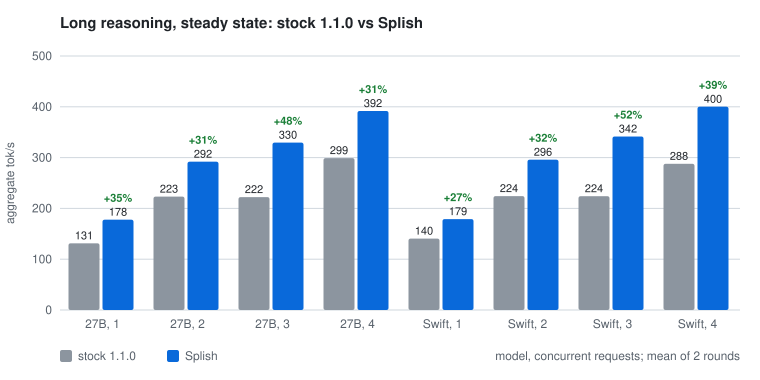

<!-- splash-m5 public write-up. DRAFT: private until the fork goes public. At go-live,
     link this from the top of the repository README. -->

# splash-m5

splash-m5 is a fork of [Inco's Splash](https://github.com/incoai/splash) that retunes and
extends its Metal kernels for Apple **M5**-family GPUs. It was developed and measured on a
40-core **M5 Max** (128 GB).

What the fork adds on top of Splash 1.1.0:

- **Faster decode for Qwen3.8-27B-family models.** New split-K verify kernels
  (`SplitSums32`) and measured kernel choices for the 27B shapes. On Inco's own
  Qwen3.8-27B package it is **31–48% faster than stock** on long reasoning at 1–4 concurrent
  requests, and 15–37% on short 512-token answers. It also uses less energy per token at
  3–4 requests. Quality is unchanged at 95/95.
- **Kernel choices from a file** (`SPLASH_KERNEL_CHOICES`), so a device can be retuned without
  a rebuild. The same mechanism covers GGUF (block-quantized) decode.
- **Tools that keep the numbers honest.** They include a kernel bench checked against fp64, a
  whole-step benchmark with confidence intervals, bit-for-bit build comparison and a
  steady-state serving benchmark with power readings.

**It is not faster everywhere.** Most of the single-request gain on a 27B comes from measured
kernel choices, which Splash's own `tune-kernels` tool can also produce for its built-in
kernels. The fork's own kernels pay off mainly at 2–4 concurrent requests. Long-context decode (past ~40K tokens) is limited by
attention, and nothing here moved it measurably. On GGUF models the gains are small (~2%).
[Where stock is ahead or even](#where-stock-is-ahead-or-even) lists these cases.

Everything else is Inco's: the engine, the package format, the models and draft models, and
the server. The fork tracks upstream releases deliberately (currently Splash 1.1.0; the
`upstream` remote).

- [Quick start](#quick-start)
- [Recommended settings](#recommended-settings)
- [Versus stock Splash](#versus-stock-splash)
- [What worked](#what-worked)
- [What did not](#what-did-not)
- [Ideas left to try](#ideas-left-to-try)
- [Reproduce](#reproduce)
- [Credits](#credits)
- [Support](#support)

## Quick start

Requirements: macOS 26.4 or newer, Xcode command-line tools and an M5-family Mac. Other
Apple GPUs run, but the choices files are tuned for a 40-core M5 Max. The server needs
Python 3 with `install/requirements.txt`; Homebrew Splash's own environment works.

```sh
git clone <this repository> splash-m5 && cd splash-m5 && make
PKG=~/.cache/huggingface/hub/models--incoai--Qwen3.8-27B-Splash/snapshots/<revision>
SPLASH_KERNEL_CHOICES=tuning/m5max-40c-swift15-v8.choices \
  python3 server/server.py $PKG/target $PKG/draft --tokenizer $PKG/tokenizer \
  --model incoai/Qwen3.8-27B-Splash --binary build/splash --port 8080
```

The server logs `Installed supplied kernel choices.` when the file loads. It speaks the
same OpenAI-compatible API as Splash.

## Recommended settings

| Model | Choices file | Notes |
|---|---|---|
| Qwen3.8-27B family, Splash package (Inco's, Swift-1.5, other fine-tunes) | `tuning/m5max-40c-swift15-v8.choices` | Tuned on a 40-core M5 Max. Other M5 chips: run the tuner (`dev/tuning`). |
| Qwen3.8-27B GGUF Q8_0 | `tuning/m5max-40c-swift15-q80.choices` | ~2% |
| Qwen3.6-35B-A3B | none | The fork adds nothing measurable here. |

Draft length: keep Splash's 7 drafted tokens. On the long-reasoning load 50–62% of verify
steps accept all 7 (45–48% on Qwen3.6-35B). A draft cut to 5 keeps only ~81% of the tokens
per step, more than a shorter verify could save.

Heat: sustained 3–4-request load peaked at 92–94 °C GPU on both engines, with the default fan
behaviour. For long agent sessions, set a fan curve that reaches full speed by 80–85 °C.

## Versus stock Splash

**Method.**
- **Builds.** Stock is vanilla Splash 1.1.0. The fork is this repository with the v8
  choices. Both ran on the same M5 Max with the same packages, side by side on separate
  ports.
- **Serving load.** C concurrent requests (C = 1–4), each generating up to 4,096 tokens
  from a long-reasoning prompt with the recommended sampling (temperature 1.0, top_p 0.95,
  top_k 20).
- **Metric.** Aggregate decode tok/s, counted only while all C requests decode
  (`dev/m5/serve_bench.py`). Package power and GPU temperature come from `macmon` over the
  same window.
- **Repeats.** Each value is the mean of two rounds, with stock and fork alternating. Runs
  vary by up to ~7% (single cells up to 8%), so **differences under about 5% are ties**.
- **Splash's own harness.** `dev/benchmarks/http_regression.py` (ABBA order, `abba.py`'s
  pass rule) measured decode ms per token and time to first token at 2K and 32K context.
- **Quality.** A 95-task set (maths, code, reasoning, exact-match scoring) on both builds.

**Which build.** The long-reasoning, quality and harness numbers (2026-09-26 overnight) use
the current build, G4a and A4 included. The 512-token rows and Swift's step times predate
G4a and A4. Both changes are bit-identical and affect GGUF models and long context only.

### Where splash-m5 leads

Inco's Qwen3.8-27B package (`incoai/Qwen3.8-27B-Splash`), aggregate tok/s, fork and change
against stock:

| Load | C=1 | C=2 | C=3 | C=4 |
|---|---:|---:|---:|---:|
| Greedy, 512 tokens | 98.8 **+26%** | 163.9 **+23%** | 170.8 **+24%** | 209.7 **+15%** |
| Sampled, 512 tokens | 90.5 **+23%** | 151.3 **+28%** | 171.2 **+37%** | 208.6 **+28%** |
| **64K-token document, summarise, steady state** | 73.4 **+12%** | 118.2 **+24%** | | |
| **Long reasoning, steady state, sampled** | 177.7 **+35%** | 292.0 **+31%** | 329.5 **+48%** | 391.8 **+31%** |
| Energy per token, J (stock → fork) | 0.65 → 0.36 | 0.24 → 0.30 | 0.25 → 0.22 | 0.21 → 0.19 |




Stock for reference: greedy 78.2 / 133.7 / 137.8 / 182.6 tok/s, sampled 73.8 / 118.2 /
124.9 / 163.4, and long reasoning 131.3 / 223.2 / 222.2 / 299.0. Long-reasoning maths drafts
very well (about 6.2 tokens per verify step), which is why its tok/s are higher than the
short answers'.

Swift-1.5 on the same long-reasoning load: 140.5 / 224.2 / 224.1 / 287.7 → **179.0 / 295.8 /
341.5 / 400.2** tok/s (+27% / +32% / +52% / +39%). Energy at 4 requests is 0.32 → 0.18 J per
token.

**TensorFold's client** (`tools/bench_openai.py` from
[ashhart/TensorFold](https://github.com/ashhart/TensorFold), via `dev/m5/tensorfold_bench.py`;
64-token replies, 5 seeds, 2 rounds). Code and chat, sampled and greedy, tok/s:

| | Code, sampled | Chat, sampled | Code, greedy | Chat, greedy |
|---|---:|---:|---:|---:|
| Stock Splash 1.1.0 | 156.6 | 77.8 | 142.1 | 75.1 |
| **splash-m5** | **202.6** | **88.6** | **176.1** | **91.9** |
| TensorFold 0.3.4, as published for an M5 Max | 168.4 | 69.3 | 154.7 | 73.5 |

The TensorFold row is its own published measurement: a different checkpoint and drafter, a
raw-completion code prompt, and a different session. Treat it as a reference point, not a race.

**Splash's own harness** (`http_regression.py`, ABBA, Inco's pass rule) on Inco's 27B: decode
**5.93 → 4.60 ms per token (−22%), pass**. Time to first token is identical at 32K
(39.5 s vs 39.4 s). At 2K it is +0.7%, but that run's spread was 6.9%, above the rule's 5%
limit, so the rule calls it inconclusive rather than a regression.

Swift-1.5 (a Qwen3.8-27B fine-tune, same shapes), decode step time from Splash's
`decode_profile` with a 2,048-token prompt:


| Requests | Stock 1.0.2 | 1.0.2 + tuned choices | splash-m5 (v8) |
|---|---:|---:|---:|
| 1 | 49.0 ms | 41.5 ms | **40.5 ms** |
| 2 | 59.1 ms | 59.4 ms | **44.9 ms** |
| 3 | 87.2 ms | 88.2 ms | **59.3 ms** |
| 4 | 87.0 ms | 85.8 ms | **62.9 ms** |

At one request the fork adds ~2.5% over tuned choices alone. The gain from the fork's own
kernels is at 2–4 requests (1.3–1.5×).

**Quality.** Swift-1.5 scores 95/95 on both engines, and 380/380 with four copies running
concurrently. On Inco's 27B: stock 95/95, fork 95/95. The fork's greedy text
differs from stock at near-ties because the split-K kernels add in a different order. Both
engines are deterministic run to run.

### Where stock is ahead or even

| Case | Result |
|---|---|
| Speculative acceptance, Inco's 27B | Fork 0.380 vs stock 0.398 (greedy, 16 prompts). Slightly lower; the speed gain covers it. |
| Long-context decode (40K+) | Tie. Attention sets the limit, and the one change kept (A4) is ~3% of attention and not visible per step. |
| GGUF Q8_0 decode, 2 requests | Tie (−0.1%). 1, 3 and 4 requests: ~2% faster. |
| Qwen3.6-35B-A3B (tuning) | Not tuned. The fork's attention change is disabled for its shape, where it was 3% slower. |
| Time to first token, 2K / 32K | Tie (+0.7% / −0.2%). The 2K run was too noisy for Inco's rule to pass it. |
| Qwen3.6-35B-A3B, long reasoning, 1–4 requests | Tie: −2% / −1% / −4% / +2%, inside its 5–7% run spread. |

## What worked

1. **Split-K verify kernels with row sums computed once (`SplitSums32`)** on the MPP tensor
   units. The residual, plain and gate/up projections gained at 16–32 rows, which cut the
   step 23–32% at 2–4 requests.
2. **Lighter barriers (H1).** A simdgroup barrier replaces a threadgroup one where a tile
   has one simdgroup.
3. **Measured choices per shape** (`v8`), loaded from a file.
4. **GGUF input prefetch (G4a).** The staged GGUF tile now prefetches its input rows a step
   ahead into space freed from its weight stage. It uses the same threadgroup memory,
   produces bit-identical output and is 2–8% faster at 32 rows.

   
5. **Attention QK on 4 simdgroups for 6-head groups (A4).** Bit-identical; attention 2–3%
   faster.

## What did not

The full log, with numbers, is in [FORK.md](../../FORK.md).

| Idea | Result | Why |
|---|---|---|
| Epilogue redesigns (bias matmul, early loads, shuffles, cache) | No gain | The 32-row matmul is compute-bound at ~57 TFLOPS. |
| Kernel fusion | −0.1% | Launch cost is not the gap. |
| Concurrent encoder | 0.6–2.9% slower | Decode is a dependency chain. |
| Attention: operand swap (A1) | Wrong output | Discarded. |
| Attention: two pages per step (A2), next-page prefetch (A3) | 0%, −2% | Not latency-bound. |
| Attention: int8 × int8 QK (A6) | 3–7% slower, 3× the error | The M5 tensor unit is no faster at int8 for this shape. |
| GGUF: extra threadgroup memory (G1) or registers (G2) for prefetch | 17–35% slower | The tile's occupancy collapses above 8 KB. |


**Findings that should transfer to other M5 work:**
- Verify attention is bound by the tensor unit's bf16 × int8 matmuls. The softmax between
  them is serialized.
- The GGUF staged tile's speed depends on its threadgroup-memory footprint. Doubling it
  cost 30–38%.
- MPP's `relaxed_precision` flag had no measurable effect on bf16 × int8 QK.

## Ideas left to try

1. **Attention rewrite.** Overlap one threadgroup's softmax with another's matmul (a
   producer/consumer layout). It is the only lever left for long context.
2. **Draft length: tested, keep 7.** Acceptance histograms (`SPLASH_M5_ACCEPT_LOG`,
   `dev/m5/accept_hist.py`) show 50–62% of steps accepting every drafted token. A shorter
   draft loses more tokens than a shorter verify saves. ninfer-ext's gain from K=5 on CUDA
   does not transfer here.
3. **Long context beyond 64K.** At 64K the fork holds its lead (+12% / +24% at 1 / 2
   requests). The absolute slowdown with context is attention (idea 1).
4. **DFlash draft fine-tuned on Swift.** Swift runs Inco's base-model draft. On maths
   reasoning that draft already accepts as well on Swift as on the base model (~6.3 tokens
   per step). The open question is Swift's everyday prose and code, where a draft trained on
   Swift's own outputs should do better. Cloud compute for this is what
   [Support](#support) is for.
5. **Batch width 8.** A plan exists (the converter project's `docs/PLAN_CONCURRENCY.md`).
6. **Q4_K and other GGUF formats.** G4a applies to them but is only measured on Q8_0.
7. **Token-agreement check.** Compare next-token choices position by position against
   upstream, as the M1 port does. It is a finer quality gate than a task set.
8. **Tuning other M5 chips.** The choices files are for a 40-core M5 Max.

## Reproduce

```sh
make && dev/m5/build.sh
dev/m5/tonight.sh                                 # every serving, quality and harness number above
./build/m5/kernel-bench build/splash.metallib --check              # affine Q4 kernels, fp64
./build/m5/kernel-bench build/splash.metallib --gguf q80 --check   # GGUF Q8_0
python3 dev/m5/step_bench.py base=- new=tuning/m5max-40c-swift15-v8.choices
python3 dev/m5/charts.py                          # the charts in docs/m5/charts
```

## Credits

- **[Inco](https://github.com/incoai/splash)** built Splash, its models and its DFlash draft
  models. This fork only changes kernels and tuning.
- **SnooPredictions515**, whose M1 port and write-up
  ([r/LocalLLaMA](https://www.reddit.com/r/LocalLLaMA/comments/1wmbbf9/splash_engine_qwen3827b_in_native_8bit_at_3755/))
  suggested the attention and quality-agreement experiments we ran.
- **[giveen/ninfer-ext](https://github.com/giveen/ninfer-ext)** for the reporting layout this
  write-up follows: method first, and losses next to wins.
- **[ashhart/TensorFold](https://github.com/ashhart/TensorFold)** for its benchmark client and a
  detailed recipe for the same model on the same chip. Its draft trees, copy rule and draft
  vocabulary are on our list, and its negative results saved us time.

## Support

If this is useful and you would like to help fund cloud compute for fine-tuning a DFlash
draft model for Swift: [ko-fi.com/severalviolins](https://ko-fi.com/severalviolins).
